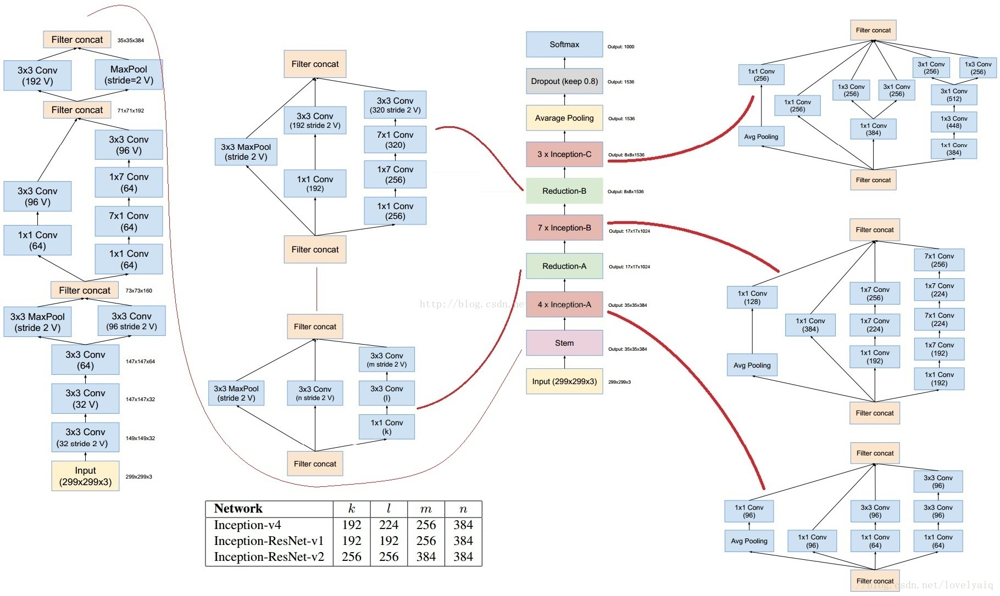
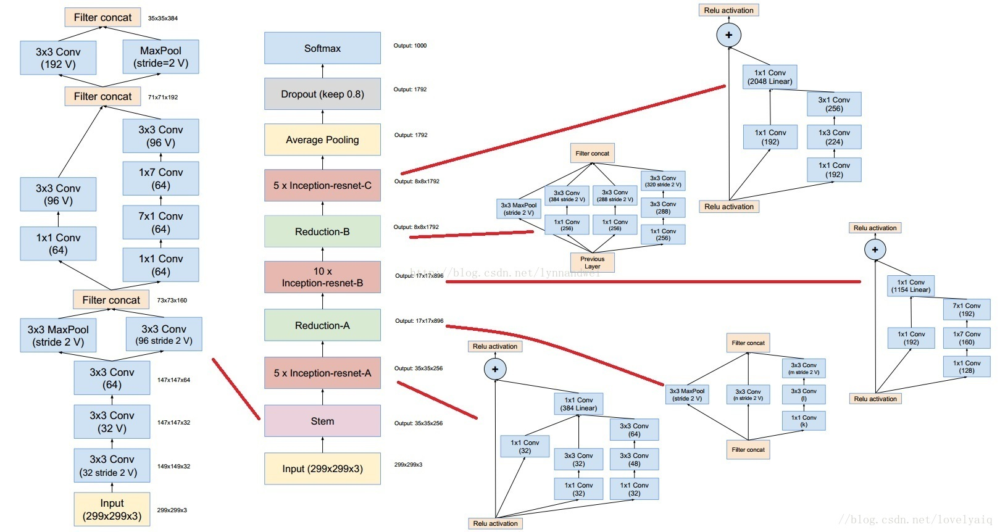
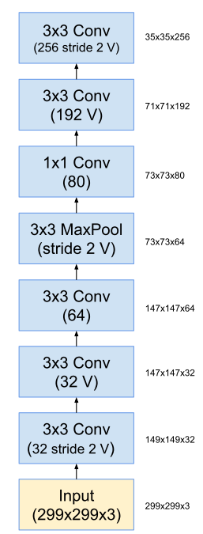

本文提出了Inception-v4、Inception-ResNet-v1、Inception-ResNet-v2三种网络结构。

Inception-v4的网络结构如下图：

Inception-ResNet-v2的网络结构如下图：

Inception-ResNet-v2的stem与V4的结构类似，Inception-ResNet-v2的输出chnnel要高。Reduction-A相同。

Inception-ResNet-v2与Inception-ResNet-v1的结构类似，除了stem部分。Inception-ResNet-A、Inception-ResNet-B、Inception-ResNet-C和Reduction-B的结构与v1的类似，只不过输出的channel数量更多。 

Inception-Resnet-v1的stem结构与Inception-v3的stem结构一样:

