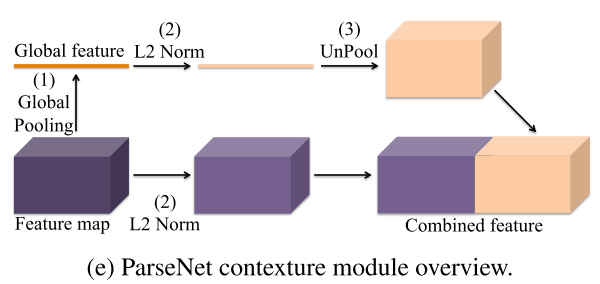
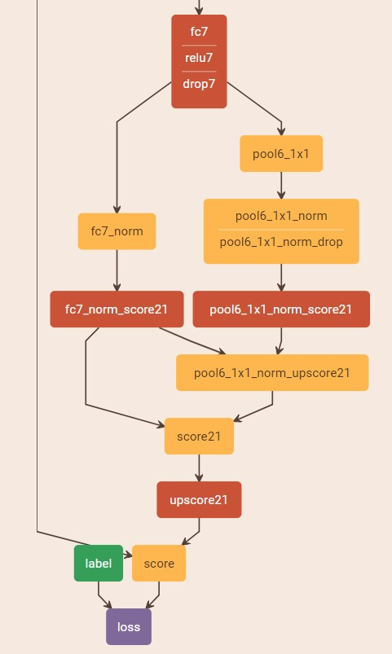

#### Abstact

​	提出使用某层的平均feature来增强该层中每个位置（像素点）feature以用于语义分割中来添加global context信息。

#### Global Context

​	理论上网络的顶层特征有非常大的receptive fields(如:基于VGG的FCN网络的fc7层，应该有一个404*404的感受野），而实际上，其感受野比这个小很多，不足以提取global context。

https://github.com/weiliu89/caffe/tree/fcn

