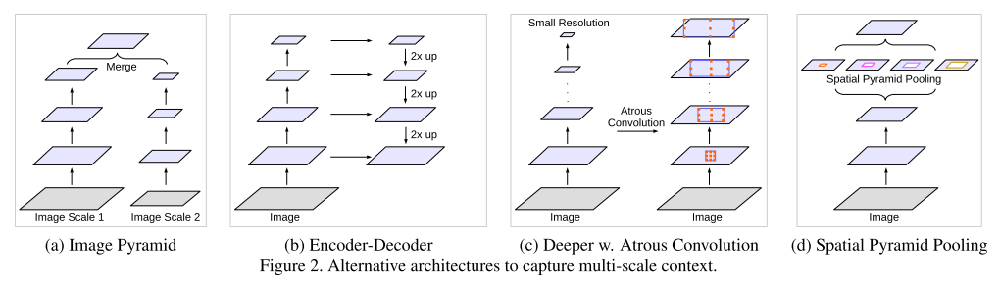
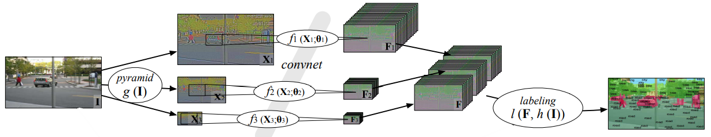

（a）：图像金字塔。
	将input图像通过Laplacian、Gaussian金字塔等方法生成不同scale的图像，并将他们同时送入一个相同的卷积特征提取网络，然后将各自输出的特征进行合并，作为该图的最终特征，用于具体的任务预测。

	Merge过程：不同尺度图像，各自得到的feature map的大小不同，无法直接merge，通用的做法是将每个不同scale的feature map统一unsampling到同样的大小，再concate，具体可参考论文“Learning Hierarchical Features for Scene Labeling”。当然,我认为除了unsampling外，应该也可以借鉴SPPNet中思想，统一Pooling到同样的大小。

（b）：Encoder-Decoder。

	

