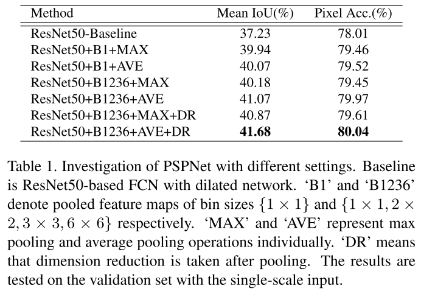

### Abstract

​	本文，我们极力的开拓全局上下文信息的作用通过使用我们提出的Pyramid scene parsing network(PSPNet,金字塔场景解析网络)来聚合不同的region区域的上下文信息。我们的global prior representation在场景分类任务对于产生高质量的结果是非常有效的，同时PSPNet提出了一个用于像素预测的优秀框架。

### Main  Contributions

1.  提出了利用PSPNet嵌入困难场景上下特征，用于基于FCN的像素预测框架。
2.  提出了一个用于ResNet的基于deeply supervised loss的优化策略。

### Pyramid Pooling Module

主要过程：

1.  CNN特征提取层，本文采用RestNet网络.
2.  将1中输出的feature map，分别将其划分为$1*1$、$2*2$、$3*3$、$6*6$的网格，然后采用类似SPPNet中方法分别进行pooling，这样得到4组尺度为$1*1$、$2*2$、$3*3$、$6*6$的特征图.
3.  对每个池化后不同尺度的feature map，各自采用$1*1$的卷积核来减少feature map的个数.
4.  将3中输出的各个不同尺度的特征图upsample到与1中CNN提取的特征图的大小.
5.  将4中所有的特征图及1中CNN输出的特征图进行concat.

##### 对比试验1：不同参数设置

### Auxiliary loss（辅助loss）

