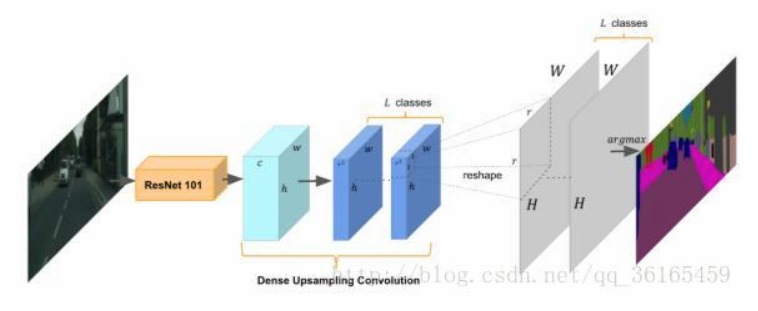
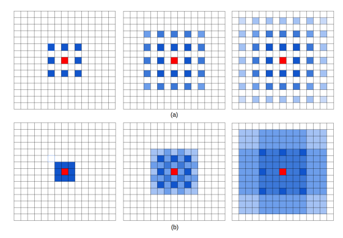
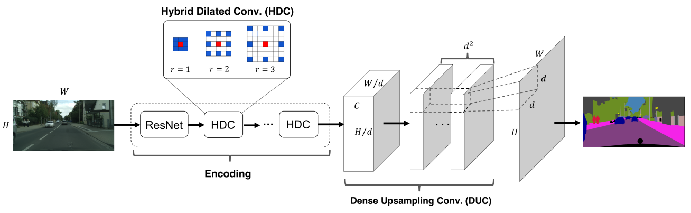

### Abstract

本文主要是针对已有的FCN+CRF+Atrous convolution 中的**上采样**和dilated convolution 进行了改进， 提出了替代的dense up-sampling convolution (DUC)和hybrid dilated convolution（HDC）。其优点是扩大网络的感受野，以聚集更多的全局信息；解决由标准dilated convolution 所引起的”gridding 效应”。

### **Motivation**

作者总结了语义分割的一般过程主要有两个过程：encoding（编码阶段：从输入图片到特征图）及decoding（译码阶段：从特征图到输出标签图）。本文改进的来源是对之前最新成果存在问题的思考，一是在译码阶段，需要得到和输入图片相同尺度的标签图，需要将特征图进行上采样，之前采用的双线性插值上采样是没有学习性的，因此会丢失很多细节信息，而卷积层是有学习性的，因此作者提出了dense up-sampling convolution (DUC)。二是在编码阶段，采用之前的Atrous convolution（dilated convolution），它的主要的思想是在卷积核的像素之间插入“holes（也就是0）”，来增加图像的分辨率以及提高网络的感受野，从而可以在deep CNNs 中提取密集特征，消除下采样的使用（max-pooling 或者是strided convolution）。但是这种操作会产生一个“gridding issue”。这个问题指的是在rate of dilation 增大的时候，每个卷积核的感受野变得非常宽广，但是实际的获得信息却又很少，导致丢失了一些 neighboring information，同时也因为太稀疏无法覆盖到局部信息。因此作者提出了hybrid dilated convolution（HDC）。

### **两个改进点**

#### **dense up-sampling convolution (DUC)**

假设原图大小为H×W，经过ResNet 后维度变为h×w×c（其中h=H/r，w=W/r），通过卷积后输出feature map 维度为h×w×(r^2×L)，其中L 是语义分割的类别数。最后通过reshape 到H×W×L 尺寸就可以了。DUC 的核心思想就是将整个label map 分成若干个和输入特征图（heatmap）大小相等的部分。所有的子部分被叠加r^2 次就可以产生整个label map 了。这种变化允许我们直接在输入特征图和输出标签图之间进行卷积操作，而无需像反卷积层一样插入额外的值（“unpooling”操作）。”此外，DUC 网络可以融入到FCN 框架中，可以使整个编码和解码过程变成端到端的训练。

DUC 不同于传统的一次性生成全分辨率的label map，通过学习一系列放大滤波器将缩小的特征图放大到所需大小的dense feature map。DUC 能够自适应FCN 框架，进行端到端的训练，在Cityscapes 上得到较高的mIOU，尤其**对相对较小的物体上效果较好**。

#### **hybrid dilated convolution（HDC）**

这部分主要是针对dilated conv 的“gridding issue”，如果多个层的dilation 是一样的，那么网络贡献的数值只有那些稀疏的点上的数值。当dilation变大的时候，由于down sampling 等操作，来自input 的采样会更加稀疏，局部信息可能完全丧失，同时大距离的信息也可能不再相关。

本文为了改进这个问题，把dilatioin rate 变成锯齿形式的，也就是不同层之间的dilation 不断变化，导致了以上的结果。HDC 的另一个优点是，由于dilation rates 可以是任意的，所以能够天然增大网络的感受野，对于识别相对大的物体表现得很好。有个需要注意的地方，本文认为在一组中的dilation rate不应该有公因子关系，否则gridding issue 会仍然存在。

在实验中体现HDC 更好，比如对于resnet 的res4b 模型，包括23 个blocks with dilation rate = 2，将每3 个blocks 放在一起，改变他们的dilation rates为1,2,3。对剩下的两个block，比如res5b 模型，包含3 个blocks with dilation rate r = 4，将他们分别改成3,4,5。

### **总结**

这篇论文没有像之前一样提出新的框架结构，算是在原有网络结构的基础上进行改进，但是这两个改进的效果是比较好的。纵观这几篇论文，其改进的思路都有异曲同工之妙，无非是想要把更多的信息融合到特征中，从而增加预测的准确率。[PSPnet](http://blog.csdn.net/qq_36165459/article/details/78344709) 是想把全局上下文信息（context）融合到训练过程中；[RefineNet](http://blog.csdn.net/qq_36165459/article/details/78345269) 是想除了高层和低层的信息，还要把中间层的信息也加入到训练过程中，认为每一层的特征都是有用的；而本篇论文则是想把因为下采样丢失的信息找回来；之前的[LIP](http://blog.csdn.net/qq_36165459/article/details/78339214) 也是为了将结构化特征加入进来。但是他们处理的方式有所不同，PSPnet 和RefineNet 都是考虑整合多尺度特征，将不同尺度的特征提取出来，通过卷积等操作再将这些特征进行加权融合或者相加；其中，PSPnet和LIP 都对loss 进行了重新定义，加入了新的上下文信息相关loss 和人体结构化loss；本篇论文是将完整的label map 分解成大小相同的多块，然后进行整合，实现端到端的训练和与FCN 的衔接。