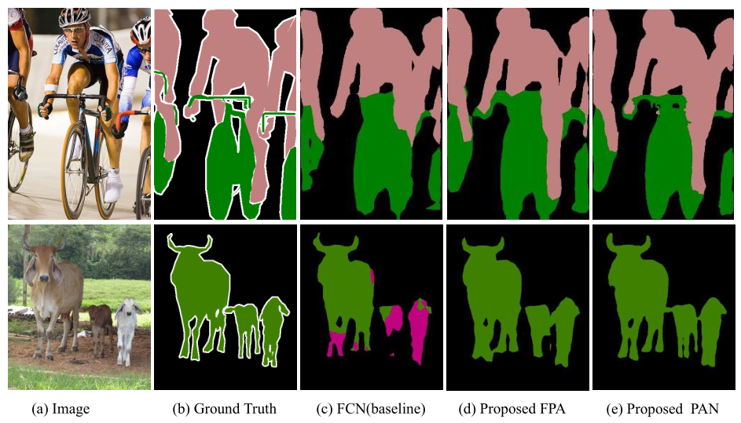
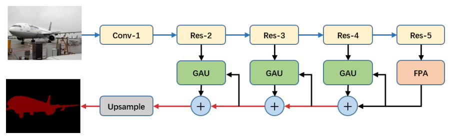

#### 1.Abstract

 	我们结合attention机制和空间金字塔来提取准确的dense features用于像素分割中，而不是采用复杂的dilated convolution和人工设计decoder网络。我们通过Feature Pyramid Attention模块来完成高层输出中空间金字塔的attention 结构与global pooling的结合来学习更好的特征表示。每个decoder layer中的Global Attention Upsample 模块提供global context来指导低层的特征来选择类型定位信息。

#### 2.Introduction

​	作者认为PSPNet通过在不同的gird scales中执行spatial pyramid pooling(空间金字塔池化)也能像素级定位信息。而DeepLab的ASPP(Atrous Spatial Pyramid Pooling)模块采用不同rate的atrous convolution卷积是一种稀疏计算，可能导致“gridding”问题。

​	受SENet和Parsenet的启发，我们尝试为CNNs提取的高层的特征提取准确的像素级attention.下图显示了我们提出的Feature Pyramid Attention(FPA)模块能增加感受野和提升对小目标的分类能力。

#### 1.Pyramid Attention Network

   